# library-project
 ### library project by JHVAN   
#### 프로젝트 목적 :  사이트의 분위기와 여러 상호작용 요소로 사용자들의 사이트와 책에 대한 관심을 얻고, 로그인한 사용자들의 활동과 관심사에 관한 활동 데이터를 얻는 웹 사이트의 구현   

## 기술 스택 Tech Stack
**1. SpringBoot:**
**Spring Boot**
- 
    - 스프링 기반 애플리케이션 개발을 위한 오픈소스 프레임워크
    - 의존성 주입, 자동 설정 등의 기능 제공

**Spring Data JPA**
- 
    - JPA 기반의 데이터 접근 계층을 쉽게 구현할 수 있도록 지원하는 프레임워크

**Spring Security**
- 
    - 인증(Authentication)과 인가(Authorization) 기능 제공
    - JWT, OAuth2 등을 기반으로 사용자 인증 구현

**JSON Web Token**
- 
    - 토큰 기반 인증을 위한 오픈 스탠다드
    - 토큰에 사용자 정보를 안전하게 저장/전송

**MySQL**
- 
    - 오픈소스 관계형 데이터베이스 관리 시스템
    - 대용량 웹 애플리케이션을 위한 데이터 저장소

**Lombok**
- 
    - 코드 자동 생성 라이브러리
    - DTO 모델 클래스 작성 시 getter/setter등 자동 생성

**H2 Database**
- 
    - 인메모리 관계형 데이터베이스
    - 테스트 용도로 주로 사용

**JUnit**
- 
    - 자바 프로그램을 위한 유닛 테스트 프레임워크
    - 테스트 코드 작성에 사용

## 구현 상세 :    

+ 요구사항 정의 :

+ DB Diagram :   
+ https://dbdocs.io/billlys2/Library-Project-by-J.H.Van-DBDiagram

 

+ 코드 스타일:  
Controller: 
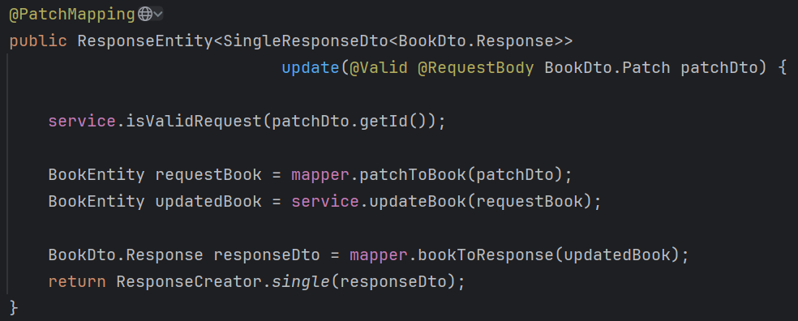
가독성을 위해 메인 도메인 관련 mapper 나 service 레이어명 앞엔 도메인 이름을 붙이지 않음.  
return 문의 가독성 향항을 위해 ResponseCreator 클래스를 만들어 타입 가독성을 높임.  
관심사 분리와 재사용 가능성을 고려하여 DTO->Entity 변환 클래스와 엔티티 업데이트 클래스를 분리함.  

DTO:  
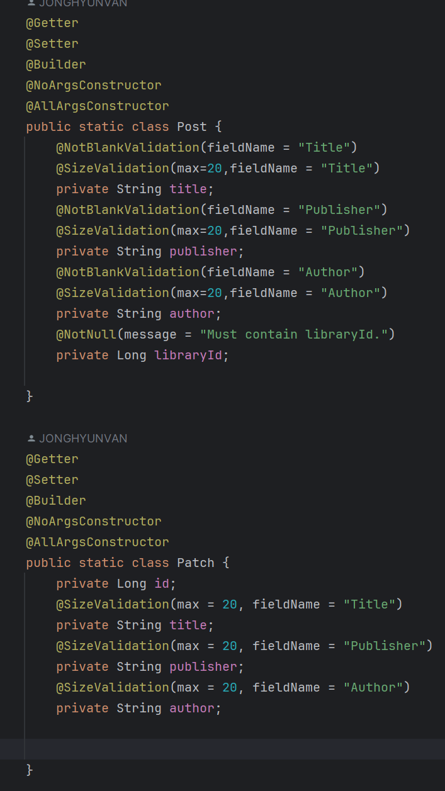  
custom validator 를 사용하여 각 상황에 적합한 벨리데이션을 구현.  
또한 각 상황별 필요한 DTO 를 따로 만들어 데이터 통신 효율을 높임.

Entity:  
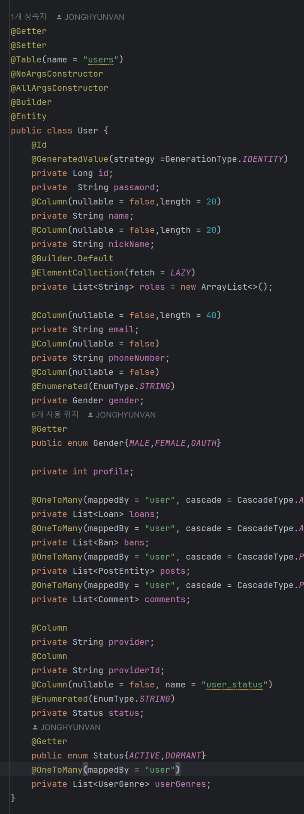  
DB에 전달하기 전 한번 더 벨리데이션 하여 더블체그 하도록 함.  

Mapper:  
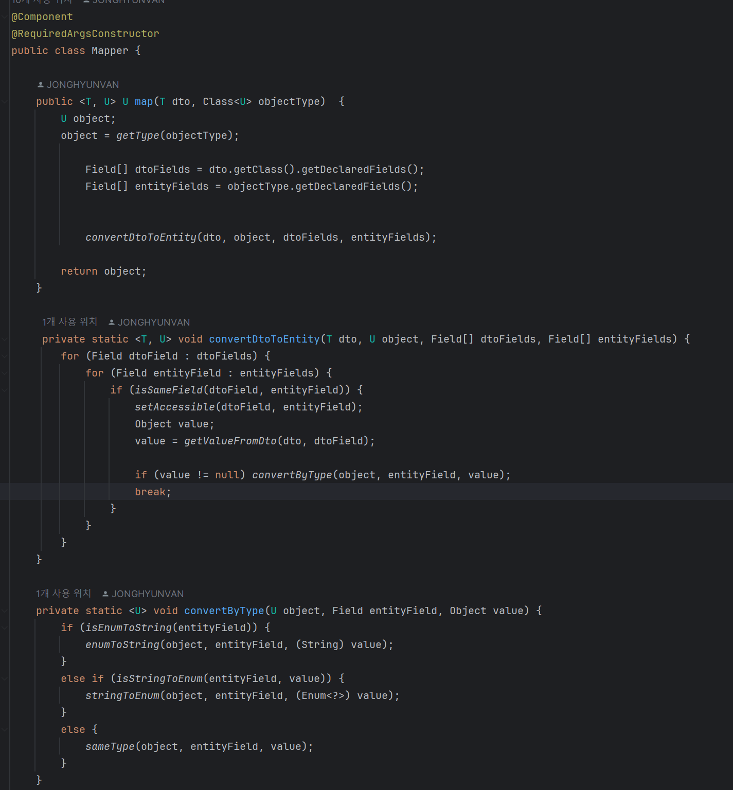  
제네릭 타입을 사용하여 필드명이 일치하는 필드끼리 매핑하는 mapper 클래스를 사용하여 DTO 변경만으로 서비스 변경사항에 대응할 수 있음.

Repository:  
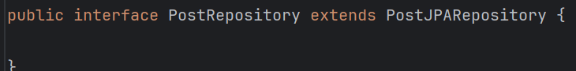  
확장형 인터페이스를 활용하여 언젠가 일어날 수 있는 migration 에 대응할 때 모든코드 변경 없이 확장자명만 변경하여 대응할 수 있음.

Service:
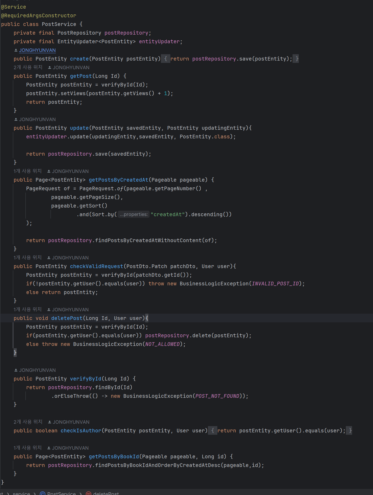  
메소드 분리를 통해 코드의 재사용을 용이하게 하여 유지보수성을 높이고, 짧아진 코드의 가독성도 높임.
대부분의 메소드를 public 메소드로 사용하여 필요하다면 다른 서비스에서도 자유롭게 필요한 메소드만 사용할 수 있음.

Paging:
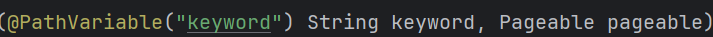  
Pageable 엔티티와 PageRequest(of) 의 구현체를 사용하여 페이징 PathVariable 을 사용하여 데이터 통신 낭비 없이 표율적인 데이터 운영을 가능하게 함.

TimeConverter:
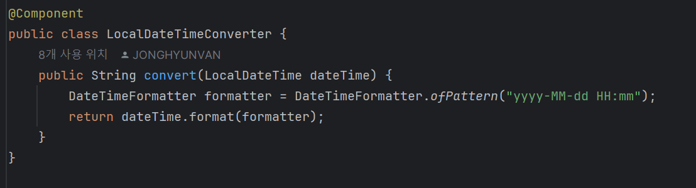  
LocalDateTime 타입은 사용자가 직접 읽기엔 과하게 많은 데이터를 사용하므로, 통신시에 사용자가 읽기 편한 형태로 미리 변환하여 사용함.

Error:
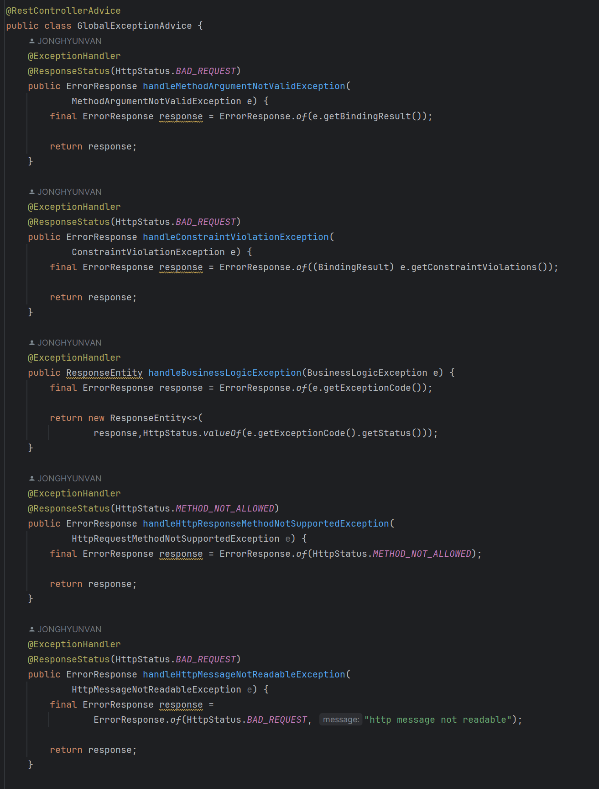  
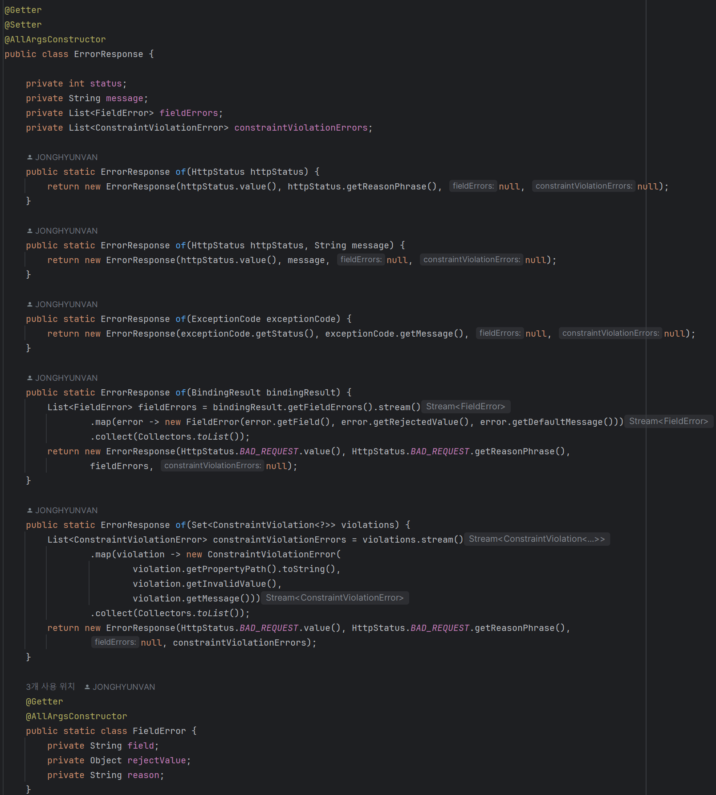  
GlobalExceptionAdvice 로 전역 예외 처리 로직을 구현 하고, ErrorResponse (DTO)Class 로 상황별 세부 에러 구현체를 만들어 전달함.
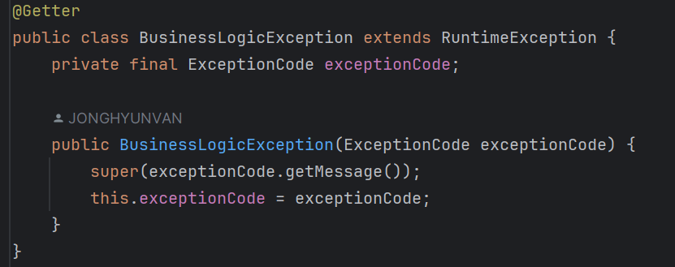  
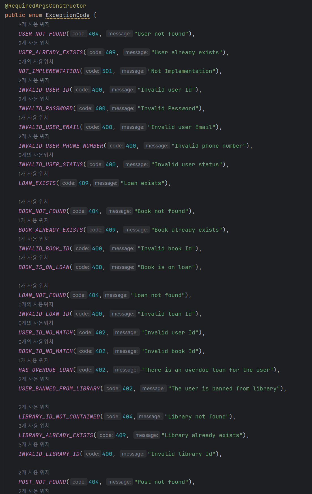  
BusinessLogicException 은 따로 Exception Code 를 만들어 ErrorResponse 에 전달함.

Security:  
기본적으로 JWT 와 Spring Security 의 일반적인 패턴을 따르는 코드를 지향하여 구현하였고,  
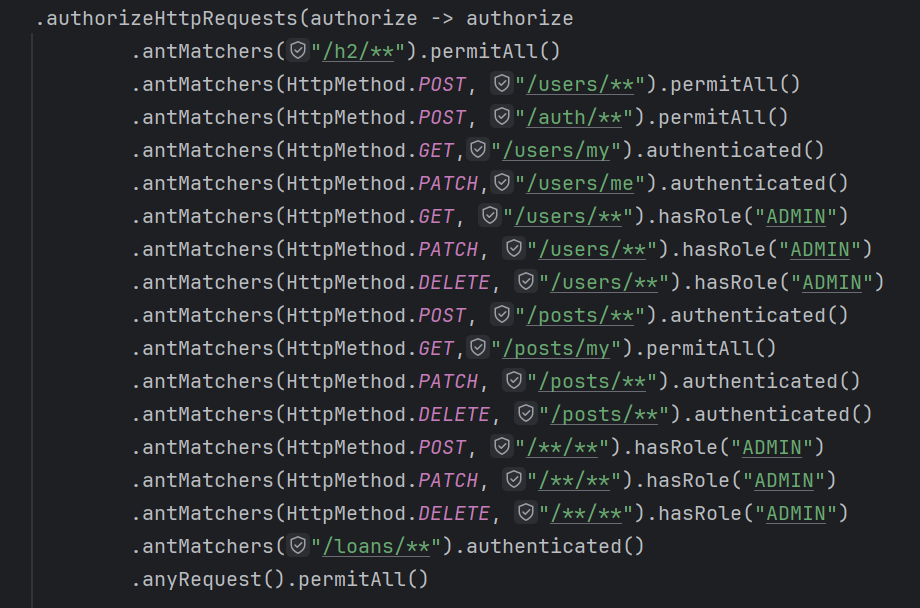  
antMatchers 를 이용해 인가 기능을 구현하여 한눈에 각 요청별 어떤 조건의 인가가 필요한지 확인 할 수 있음.  
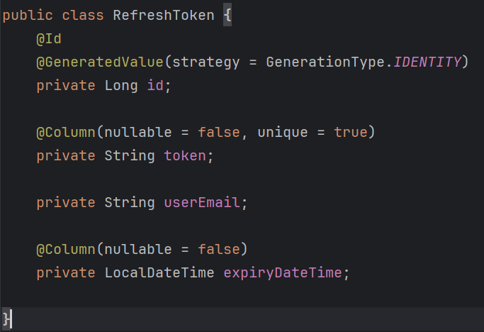  
RefreshToken 은 token 을 포함하며 userEmail, 만료시간정보를 포함한 채 DB에 저장되고,  
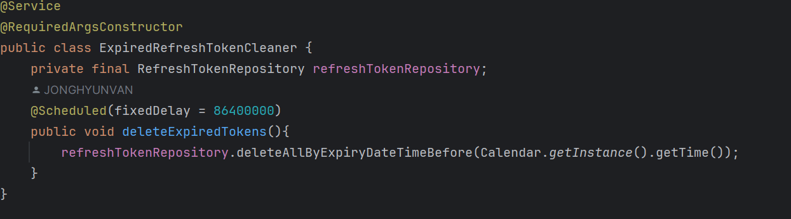  
서버 실행 후 매 24 시간마다 실행되는 cleaning 때 삭제됨.

Oauth:  
회원가입과 로그인이 따로 구분되지 않으며, 첫 로그인 시 business 자격을 얻지 못해 접근할 수 없는 정보는 임의로 생성, 저장한 뒤  
마이페이지에서 수정 가능하도록 구현함.  
계속 Oauth 제공측의 토큰을 사용하지 않고, 첫 가입(로그인)시 내부 JWT 토큰으로 교체하여 이후 통신에선 백엔드 서버의 JWT 토큰으로 인증을 진행하여 통신 효율을 높임.
