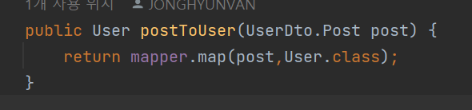

#           Library Project by J.H.Van

###                                     - frontend side
##
이 문서는 Library Project 의 프론트엔드 부분의 설명을 담은 페이지입니다.
This document is a page containing descriptions of the frontend side of the Library Project.

## 기술 스택 Tech Stack
**1. React:**
-   
  사용자 인터페이스를 구축하기 위한 JavaScript 라이브러리  
  JavaScript library for building user interfaces  

**2. Next.TSX:**
-   
  서버 사이드 렌더링(SSR), 정적 사이트 생성(Static Site Generation, SSG), API 라우트 등을 지원하는 React 프레임워크  
  React framework that supports server-side rendering (SSR), static site generation (SSG), API routes   

**3. TypeScript:**
-   
  타입 안정성을 제공하여 컴파일 단계에서 오류를 탐지하여 디버깅 가능하게 하는 JavaScript 의 슈퍼셋인 정적 타입 언어
  statically typed superset of JavaScript which provides type safety and allows for debugging by detecting errors at the compilation stage
---
**4. Redux:**
-   
  JavaScript 애플리케이션의 상태를 관리하는 데 사용되는 오픈 소스 JavaScript 라이브러리  
  Open source JavaScript library used to manage the state of JavaScript applications
-   
  Redux 개발을 간소화하는 공식 도구 모음  
  Official suite of tools to simplify Redux development
-   
  React 와 Redux 를 효과적으로 결합하는 라이브러리  
  Library which easily connects React and Redux
-   
  Next.js와 Redux 를 효과적으로 결합하는 라이브러리  
  Library which easily connects Next.js and Redux

**5. Axios:**
-   
  node.js와 브라우저를 위한 Promise 기반 HTTP 클라이언트  
  Promise-based HTTP client for node.js and browsers

**6. Tailwind CSS:**
-   
  유틸리티 클래스를 제공하여 고유한 디자인을 빠르게 구축할 수 있는 CSS 프레임워크  
  CSS framework that provides utility classes to quickly build unique designs

**7. Zod:**
-   
  TypeScript 와의 호환성이 뛰어난 데이터의 유효성 검사 라이브러리  
  Data validation library with great compatibility with TypeScript

**8. React Hook Form:**
-   
  form 관리를 간단하게 만들어주며 데이터 처리 시 코드 작성과 유지 관리를 편리하게 해주는 라이브러리  
  Library that simplifies form management and makes it convenient to write and maintain code when processing data.

**9. Nivo:**
- ![Nivo](https://img.shields.io/badge/Nivo-0.84.0-FFAAFF?style=for-the-badge&logo=data:image/svg%2bxml;base64,PD94bWwgdmVyc2lvbj0iMS4wIj8+Cjxzdmcgd2lkdGg9IjEzMSIgaGVpZ2h0PSIxMjciIHhtbG5zPSJodHRwOi8vd3d3LnczLm9yZy8yMDAwL3N2ZyIgeG1sbnM6c3ZnPSJodHRwOi8vd3d3LnczLm9yZy8yMDAwL3N2ZyIgcHJlc2VydmVBc3BlY3RSYXRpbz0ieE1pZFlNaWQgbWVldCIgdmVyc2lvbj0iMS4wIj4KIDxnIGNsYXNzPSJsYXllciI+CiAgPHRpdGxlPkxheWVyIDE8L3RpdGxlPgogIDxnIGZpbGw9IiMwMDAwMDAiIGlkPSJzdmdfMSIgdHJhbnNmb3JtPSJtYXRyaXgoMC4xIDAgMCAtMC4xIDAgMCkiPgogICA8cGF0aCBkPSJtNTI1LC00NGMtMjMwLC01MyAtNDA1LC0yMTAgLTQ3NiwtNDI3Yy0zNCwtMTA1IC0zNCwtMjYzIDAsLTM2N2MzMSwtOTYgODIsLTE3OCAxNTYsLTI1M2M3NCwtNzQgMTQ2LC0xMjAgMjQ3LC0xNTNjMTAzLC0zNSAyODksLTM3IDM5NCwtNWMxOTQsNTkgMzU1LDIxOSA0MTcsNDE0YzMyLDEwMiAzMSwyNjIgLTIsMzYzYy04NCwyNTUgLTMxMSw0MjcgLTU4MSw0MzhjLTU5LDIgLTExOCwtMiAtMTU1LC0xMHptMjQyLC0xODBjMTYzLC00MyAyODQsLTE2OSAzMjMsLTMzNWM1MSwtMjE3IC05NiwtNDU5IC0zMTUsLTUxNWMtMjQ4LC02NSAtNDkzLDk2IC01MzcsMzU0Yy01MiwzMDMgMjM3LDU3NCA1MjksNDk2eiIgZmlsbD0iI2ZmYWFmZiIgaWQ9InN2Z18yIi8+CiAgIDxwYXRoIGQ9Im02MzMsLTQyMWMtNDAsLTIxIC00MywtMjIgLTYyLC01Yy0xNCwxMiAtMzIsMTYgLTY3LDE0bC00OSwtM2wtMywtMjI5Yy0xLC0xMjYgMSwtMjMzIDYsLTIzOGM0LC00IDI4LC0xMSA1NCwtMTRjMzgsLTUgNDksLTMgNjcsMTVjMjAsMjAgMjEsMzEgMjEsMTc1YzAsMTY5IDEsMTczIDYzLDE4M2MyNyw0IDM5LDEgNTYsLTE2YzIwLC0yMCAyMSwtMzIgMjEsLTE3M2MwLC04NCA0LC0xNTggOCwtMTY1YzksLTE0IDc0LC0yNyAxMDAsLTE5YzMzLDExIDQyLDUwIDQyLDE5NGMtMSwxNjMgLTE2LDIyNCAtNjksMjY4Yy00NywzOSAtMTI4LDQ0IC0xODgsMTN6IiBmaWxsPSIjZmZhYWZmIiBpZD0ic3ZnXzMiLz4KICA8L2c+CiA8L2c+Cjwvc3ZnPg==)
  React 와의 호환성이 뛰어난 데이터 가시화 라이브러리  
  Data visualization library with excellent compatibility with React

### 개발 환경 Development Environment

**1. IDE: Intellij**
-   
  강력한 리펙토링 기능들과 실시간 오타 탐지 및 대체 단어 추천 기능, 우수한 스마트 코드 작성 기능의 장점으로 IntelliJ 를 채택함.  
  Adopted IntelliJ due to its powerful refactoring capabilities, real-time typo detection and alternative word recommendation features, as well as its excellent smart code writing features

**2. Package Manager : npm**
-   
  표준성, 내장된 보안 감사 도구 등의 장점으로 프로젝트의 패키지 관리와 의존성 처리에 npm 을 채택함.  
  Adopted npm for the project's package management and dependency handling, leveraging its advantages such as standardization and built-in security audit tools

## 프로젝트 구조 Project Structure
   
---

next 14 버전의 권장 사항에 따라, 기존의 pages 디렉토리 대신 app 폴더 안에 Route group 단위의 디렉토리를 지정하고, 각각의 page 를 생성하여 코드를 페이지 단위로 분리하였고,
배경 비디오 파일이나 , 커서와 로그인 카드 등의 이미지 파일은 public 폴더에 저장함.  
Following the recommendations of the next 14 version, a route group-level directory was designated in the app folder instead of the existing pages directory, and each page was created to separate the code into pages.
Background video files, image files such as cursors and login cards are saved in the public folder.  

## 루트 레이아웃 Root Layout
RootLayout 파일에서는 외부 폰트를 로딩하여 모든 페이지에 공통적으로 적용하고, 이를 통해 중복 로딩을 방지하고 로딩 효율을 높임.
또한, <Providers>를 사용하여 Redux store 를 어플리케이션에 연결하여 Redux 를 통해 관리되는 상태값들을 전역적으로 사용할 수 있게 함. 
이러한 상태값들은 모든 필요한 페이지에서 사용자의 로그인 여부를 일관되게 관리하고, 이후 추가될 기능들 또한 적절한 slice 를 추가하여 전역변수를 용이하게 사용할 수 있게 함.
children 구조를 사용함으로써, RootLayout 은 어떤 자식 컴포넌트도 받아들일 수 있는 유연성을 가지게 하여 렌더링하는 다양한 컴포넌트를 감쌀 수 있게 함. 
이 방식으로 모든 페이지에 공통적으로 적용하는 RootLayout 이 작동함.  
In the RootLayout file, external fonts are loaded and applied uniformly across all pages, thereby preventing redundant loading and enhancing loading efficiency.
Additionally, <Providers> can be used to connect the Redux store to the application, allowing allowing for global use of state values managed through Redux.
These status values consistently manage whether the user is logged in on all necessary pages, and any future functions can also easily utilize global variables by adding appropriate slices.
By utilizing the 'children' structure, RootLayout can accept any child component, thereby allowing it to encompass a variety of rendering components.
In this way, RootLayout, which is commonly applied to all pages, works.

## 네비게이션 바 Navigation Bar
일반적인 프로젝트에서의 네비게이션 바는 전에 서술한 RootLayout 에 포함하는것이 효율적이지만, 네비게이션 바 가 redux 로 사용되는 전역변수 등의 클라이언트 사이드
랜더링 요소들을 포함하면 서버 사이드 렌더링 되는 RootLayout 보다는 따로 component 폴더를 만들어 공통으로 적용되는 레이아웃을 만들고, 이를 Shared Layout 이라고 명명하였음.
네비게이션 바의 왼쪽은 상태와 상관없이 각 페이지로 이동할 수 있는 버튼을, 오른쪽은 전역변수를 통해 알 수 있는 사용자의 로그인 여부에 따라 다른 버튼이 나타나도록 구성됨.  
In a general project, it is efficient to include the navigation bar in the RootLayout described previously, but the navigation bar can be used on the client side, such as global variables used in redux.
Rather than RootLayout, which is rendered on the server side when rendering elements are included, a separate component folder was created to create a commonly applied layout, and it was named Shared Layout.
The left side of the navigation bar contains buttons that allow you to move to each page regardless of the status, and the right side displays different buttons depending on whether the user is logged in, which can be determined through a global variable.

## 백그라운드 비디오 Background Video
백그라운드 비디오를 사용하면 발생하는 긴 로딩 시간이 사용자들에게 불쾌한 경험을 제공하기 때문에, 대부분의 웹사이트에서는 백그라운드 비디오를 사용하지 않음.
따라서 백그라운드 비디오를 사용하려면 로딩시간 자체를 줄이거나 로딩 시간의 불쾌함을 최소화할 방법을 찾아야 했고,
후자의 방법으로  
>1. background image 를 적용하여 이용자들이 빈 배경을 보는 시간을 단축하였고,
>2. image 태그의 poster 기능을 이용하여 비디오 로딩 전 비디오의 첫 프레임이 배경으로 나타나도록 함.   

두 방법 모두 로딩시간을 오히려 길어지게 한다는 단점이 있으나, 빈 배경을 보는 시간이 줄어들어 결과적으로는 이용자들의 사용경험이 긍정적일 것으로 판단함.  
Using background videos can lead to long loading times, which create an unpleasant experience for users. As a result, most websites choose not to utilize background videos. To effectively employ background videos, it's necessary to either reduce the loading time itself or find ways to minimize the unpleasantness caused by these delays. To address the latter:
>1.Applying a background image reduces the amount of time users spend looking at an empty background.
>2.Utilizing the poster attribute of the image tag allows the first frame of the video to be displayed as a background before the video loads.

Although both methods may actually increase loading times, they reduce the time spent looking at an empty background, which is believed to positively impact the user experience overall.

## 홈 페이지 Home Page
홈 페이지의 중요한 목표는 사용자들에게 웹 사이트의 전반적인 분위기, 즉 첫인상을 전달하는 것임.  
따라서 네비게이션 바를 사용하지 않아 사용자들이 웹 사이트의 첫인상에 더 주목할 수 있게 하고, next 의 <Link> 기능을 이용해 서버 사이드 랜더링이 가능하게 하여 로딩 속도를 향상시킴.  
The primary goal of the home page is to convey the website's overall atmosphere, or in other words, its first impression to users.  
By omitting a navigation bar, we allow users to focus more on the website's first impression. Additionally, by using next's <Link> function, server-side rendering is possible to improve loading speed.

## 랭킹 Ranking
랭킹 페이지의 목적은 사용자들에게 주어진 조건(현재는 많이 검색된 순서, 추후 장르별, 대여횟수별 기능 추가 예정) 의 1  ~ 10 위의 도서의 정보를 사용자에게 제공하는 것임.
사용자들의 관심과 흥미를 유발하기 위해 도서의 이미지에 커서를 올리면 도서가 확대되고, 커서 방향으로 회전하여 사용자들의 관심을 유발함.  
도서의 이미지를 클릭하면, 바로 검색 페이지로 리디렉선되어 도서의 상세 정보를 할 수 있게 함.  
페이지 로드시에 백엔드 서버로부터 조회수 기반 top10 데이터를 받고, 이는 인증 및 인가가 필요 없는 단순 get 요청이므로 axois 를 사용하지 않고 fetch 로 받음.
The purpose of the ranking page is to provide users with information on books ranked 1 to 10 based on the conditions given to them (currently in the most searched order, functions by genre and number of rentals will be added in the future).  
When you place the cursor on the image of a book, the book enlarges and rotates in the direction of the cursor to enhance the user experience.  
When you click on the book's image, you are immediately redirected to the search page for detailed information about the book.  
When loading the page, the top 10 data based on the number of views is received from the backend server. Since this is a simple get request that does not require authentication or authorization, it is received through fetch rather than axois.

## 검색 Search
검색 페이지의 목적은 사용자들에게 제목, 저자, 출판사 기준으로 도서를 검색 할 수 있게 하는 것임.  
또한 로그인한 사용자의 경우 백엔드 서버가 검색 데이터를 수집하여 사용자의 관심 장르를 분석할 수 있게 하는 것임.
title, author, publisher 버튼에 따라 검색 기준이 정해지고, 이중 제목검색은 검색어의 일부만 검색해도 검색어를 포함하는 모든 도서를 검색 할 수 있음.  
검색 결과 리스트에서 특정 결과를 클릭하면 클릭한 결과의 색이 금색으로 변하여 사용자가 어떤 도서를 선택했는지 확인 할 수 있는데, 사용자가 어떤 검색결과를 선택하였는지는
React 의 useState 훅을 사용하여 관리됨.  
The purpose of the search page is to allow users to search for books by title, author, and publisher criteria.  
Also, for logged-in users, the backend server can collect search data to analyze the user's interests by genre.  
The search criteria are determined by the title, author, and publisher buttons. The title search can find all books containing the search terms even if only part of the terms are entered.  
In the search results list, if a specific result is clicked, its color changes to gold to indicate which book the user selected. Which search result the user selects is managed using React's useState hook.  

## 회원가입 Sign up
회원가입 페이지의 목적은 사용자들이 입력한 데이터를 바탕으로 향후 인증 인가 및 사용자 맞춤형 데이터 수집을 가능하게 하는 것임.  
신규 사용자가 가입할 때, 이름, 닉네임, 이메일, 전화번호, 비밀번호, 성별 의 정보를 입력하는데, 각 정보가 입력 혹은 변경될 때 마다
zod 에 의해 밸리데이션 되고 이 데이터는 제출 이후에 백엔드 서버에서 한번 더 밸리데이션 된 후 데이터베이스에 저장됨.  
이후 사용자가 콘텐츠를 탐색하거나 토론 게시판, 대여, ai 와의 대화 기능 등 추가될 기능들을 이용할 때 사용자 검색 및 대여 , 혹은 성별 데이터를 참조하여 사용자가 관심을 가질 만 한 항목을 제안 할 수 있는 기반이 됨.  
The purpose of the membership registration page is to enable future authentication and collection of user-customized data based on the data entered by users.  
When a new user signs up, they enter information such as name, nickname, email, phone number, password, and gender, each time each information is entered or changed.  
Validated by zod, this data is validated once more on the backend server after submission and then stored in the database.  
Afterwards, when the user explores content or uses the discussion board, rental, or chat function with AI, it becomes the cornerstone of suggesting items that the user may be interested in by referring to user search and rental, or gender data.

## 로그인 Log in
로그인 페이지의 목적은 회원 가입한 사용자들이 백엔드 서버에서 발급받은 토큰을 이용하여 자신을 인증하고, 웹 사이트에서 사용자 맞춤형 데이터를 수집하거나
수집한 데이터를 활용한 서비스를 제공받게 하는 것임.  
사용자는 회원가입 페이지에서 제출한 아이디와 비밀번호를 이용한 로그인(폼 로그인)을 이용하거나, google, kakao 등의 소셜 로그인을 이용하여 로그인 할 수 있음.  
소셜 로그인은 각각의 페이지로 새 창에서 연결되는데, 사용자가 각각의 로그인 페이지에서 로그인을 완료하면 authorization code가 발급되어 리디렉션 되고,  
리디렉션된 페이지에서는 authorization code 를 발급한 뒤, 이 코드는 백엔드 서버에 전달됨.  
이후 백엔드 서버에서 jwt 인증 토큰과 리프레시 토큰을 전달받으면, 이를 각각 local storage 와 cookie storage 에 저장함.  
토큰이 저장되면, 소셜 로그인 창이 꺼지고 redux store 에서 사용자의 상태를 로그인 한 상태로 인식함.  
The purpose of the login page is for registered users to authenticate themselves using tokens issued by the backend server, and to collect user-customized data from the website or
The purpose is to provide services using the collected data.
Users can log in (form login) using the ID and password submitted on the membership registration page, or use social logins such as Google and Kakao.
Social login connects to each page in a new window. When the user completes login on each login page, an authorization code is issued and redirected.
The redirected page issues an authorization code, which is then delivered to the backend server.
Afterwards, when the jwt authentication token and refresh token are received from the backend server, they are stored in local storage and cookie storage, respectively.
When the token is saved, the social login window turns off and the redux store recognizes the user's status as logged in.

## 마이(페이지) My (page)
마이 페이지의 목적은 사용자들이 로그인 후 웹 사이트를 이용하며 생성된 사용자 맞춤 데이터를 사용자가 직접 확인할 수 있게 nivo 를 이용한 그래프로 나타내고,
회원가임 시 기입한 개인 데이터와 함께 사용자들에게 제공하기 위함임.  
The purpose of My Page is to display customized data generated while using the website after logging in as a graph using nivo so that users can directly check it.  
It is intended to be provided to users along with the personal data entered when signing up for membership.