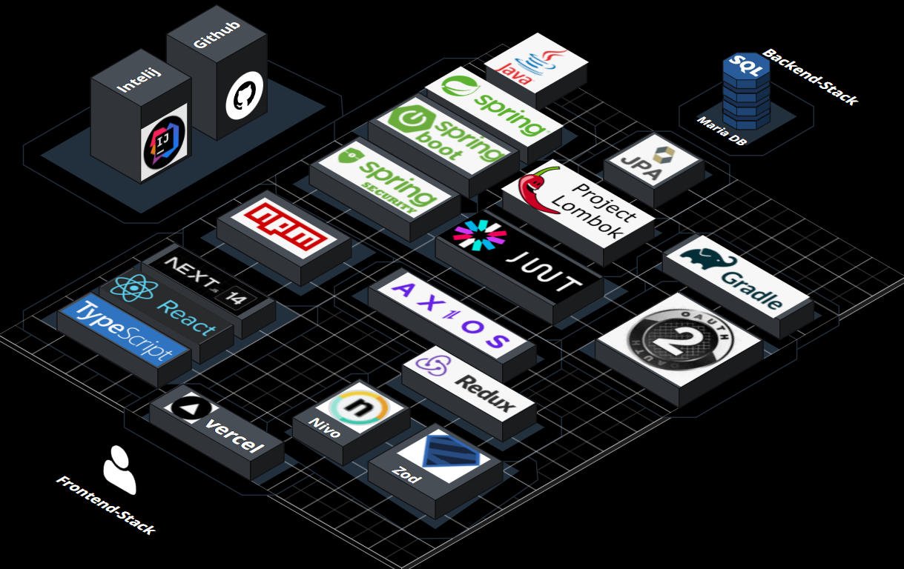

#           library-project
 ###                               library project by JHVAN   
#### 프로젝트 목적 :  
#### 사이트의 분위기와 여러 상호작용 요소로 사용자들의 사이트와 책에 대한 관심을 얻고, 로그인한 사용자들의 활동과 관심사에 관한 활동 데이터를 얻는 웹 사이트의 구현   

### 배포 주소 Deployment URL
https://library-project-blush.vercel.app/

### 사용 스택 Stacks  

### 구현 화면 Implementation screen
홈 화면 home :  

로그인 화면 login :   

마이페이지 화면 my page :  

랭킹 화면 ranking :   

검색 화면 search :  

회원가입 화면 sign up :   

각 파트에 관한 상세:
프론트엔드 사이드 : https://github.com/JONGHYUNVAN/library-project/blob/main/front/src/README.md  
백엔드 사이드    : https://github.com/JONGHYUNVAN/library-project/blob/main/back/README.md

