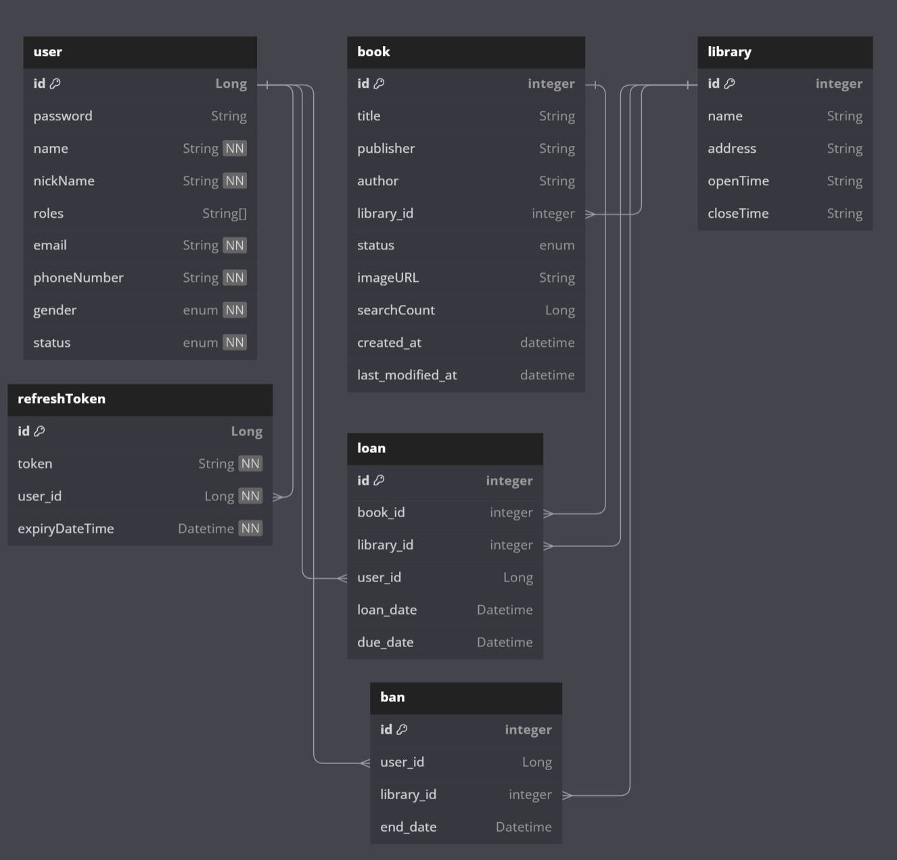

# library-project
 ### library project by JHVAN   
#### 프로젝트 목적 : 제한된 시간 안에 완성을 목표로 한 팀 프로젝트의 아쉬운 완성도를 보완한 솔로 백엔드 어플리케이현의 구현   
 구현 상세 :    
 
+ 요구사항 정의 :

+ DB Diagram :   
 
 

+ 코드 범용성 향상 : 
기존 : 속도를 중시한 builder 를 사용한 직접 빌드

속도는 빠르지만 도메인, 각각의 케이스마다의 빌드 코드를 필요로 하고,   
DTO 및 엔티티의 변경시 연관된 모든 mapper 들 역시 수정해야함.

변경 : mapper 클래스를 활용한 코드

mapper 클래스를 이용하여 매핑이 필요한 모든 도메인에 적용 가능하고,   
DTO 및 엔티티의 변경시에도 mapper 의 변경이 필요하지 않음.
+ 코드 가독성 향상 : 
기존 : 코드 진행 순서와는 일치하지만 역할에 따른 메소드 분리가 되지 않아 가독성이 떨어지는 코드

변경 : 메소드를 분리 및 추출하여 코드의 가독성과 각 메소드의 역할을 분명히 함.
