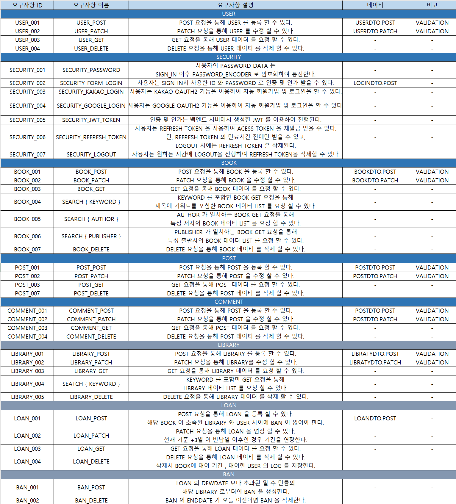
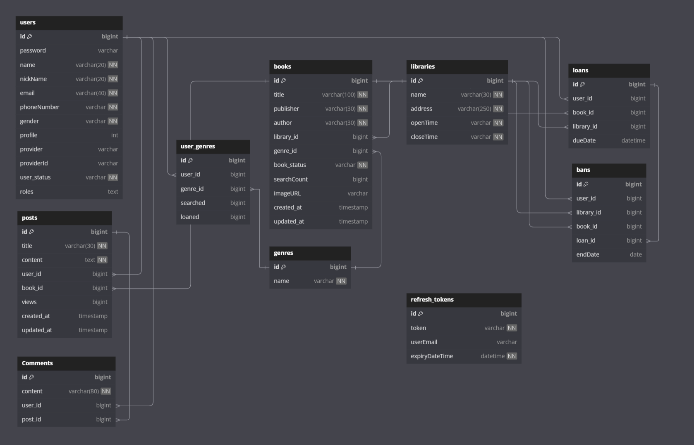

# library-project
 ### library project by JHVAN   
#### 프로젝트 목적 :  사이트의 분위기와 여러 상호작용 요소로 사용자들의 사이트와 책에 대한 관심을 얻고, 로그인한 사용자들의 활동과 관심사에 관한 활동 데이터를 얻는 웹 사이트의 구현   

## 기술 스택 Tech Stack
**1. SpringBoot:**
**Spring Boot**
- 
    - 스프링 기반 애플리케이션 개발을 위한 오픈소스 프레임워크
    - 의존성 주입, 자동 설정 등의 기능 제공

**Spring Data JPA**
- 
    - JPA 기반의 데이터 접근 계층을 쉽게 구현할 수 있도록 지원하는 프레임워크

**Spring Security**
- 
    - 인증(Authentication)과 인가(Authorization) 기능 제공
    - JWT, OAuth2 등을 기반으로 사용자 인증 구현

**JSON Web Token**
- 
    - 토큰 기반 인증을 위한 오픈 스탠다드
    - 토큰에 사용자 정보를 안전하게 저장/전송

**MySQL**
- 
    - 오픈소스 관계형 데이터베이스 관리 시스템
    - 대용량 웹 애플리케이션을 위한 데이터 저장소

**Lombok**
- 
    - 코드 자동 생성 라이브러리
    - DTO 모델 클래스 작성 시 getter/setter등 자동 생성

**H2 Database**
- 
    - 인메모리 관계형 데이터베이스
    - 테스트 용도로 주로 사용

**JUnit**
- 
    - 자바 프로그램을 위한 유닛 테스트 프레임워크
    - 테스트 코드 작성에 사용

## 구현 상세 :    

+ 요구사항 정의 :

+ DB Diagram :   
+ https://dbdocs.io/billlys2/Library-Project-by-J.H.Van-DBDiagram

 

+ 코드 스타일:  
Controller: 

가독성을 위해 메인 도메인 관련 mapper 나 service 레이어명 앞엔 도메인 이름을 붙이지 않음.  
return 문의 가독성 향항을 위해 ResponseCreator 클래스를 만들어 타입 가독성을 높임.  
관심사 분리와 재사용 가능성을 고려하여 DTO->Entity 변환 클래스와 엔티티 업데이트 클래스를 분리함.  

DTO:
