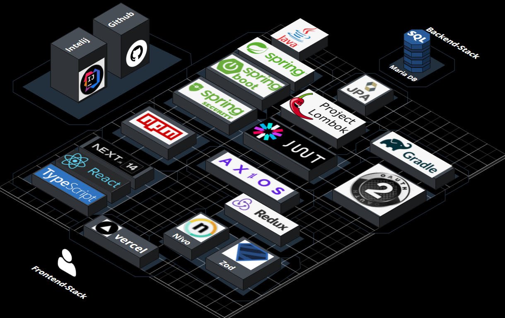
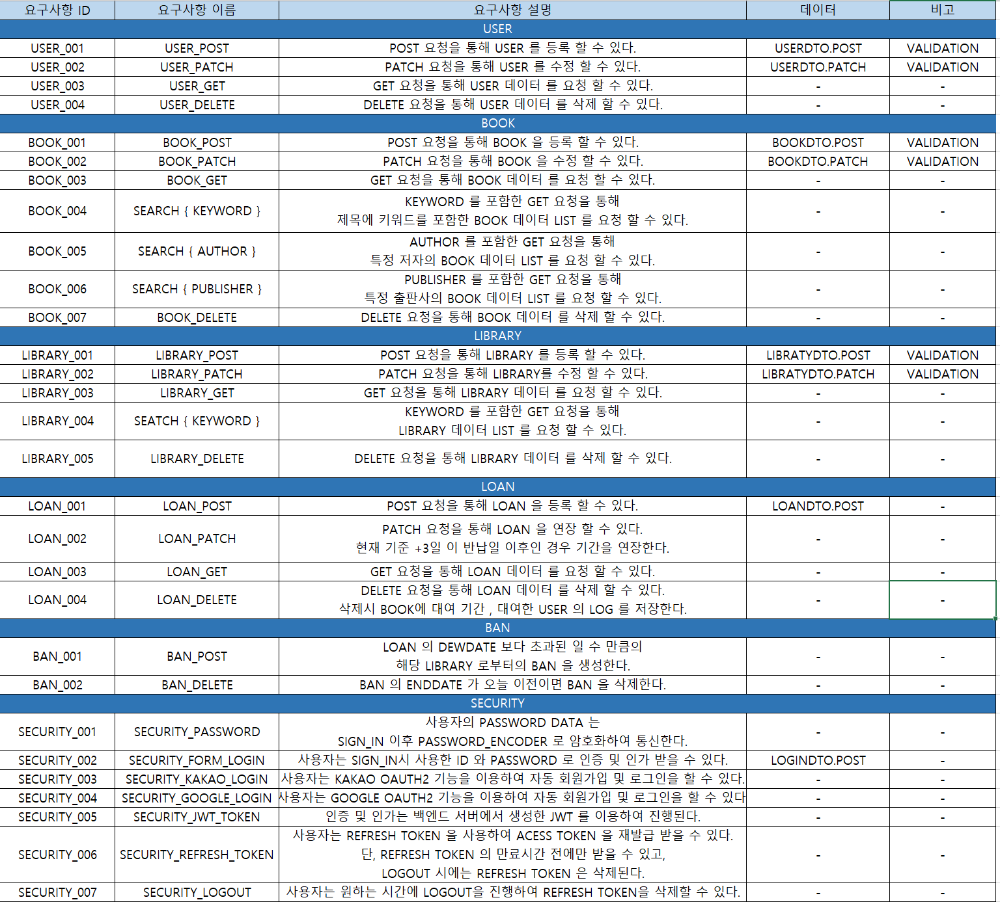
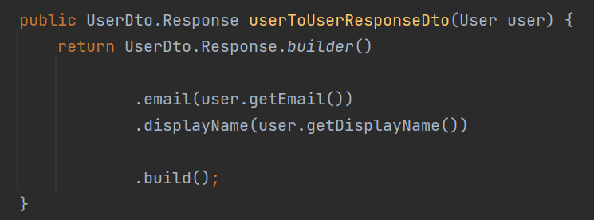
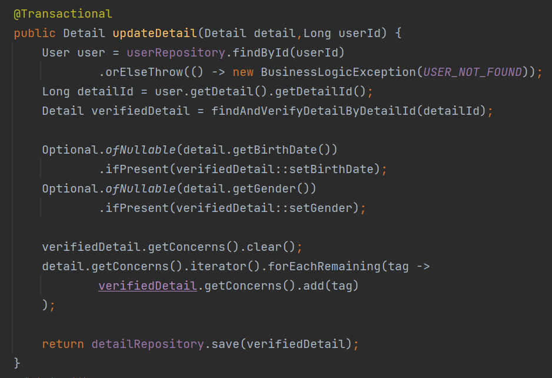
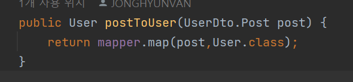
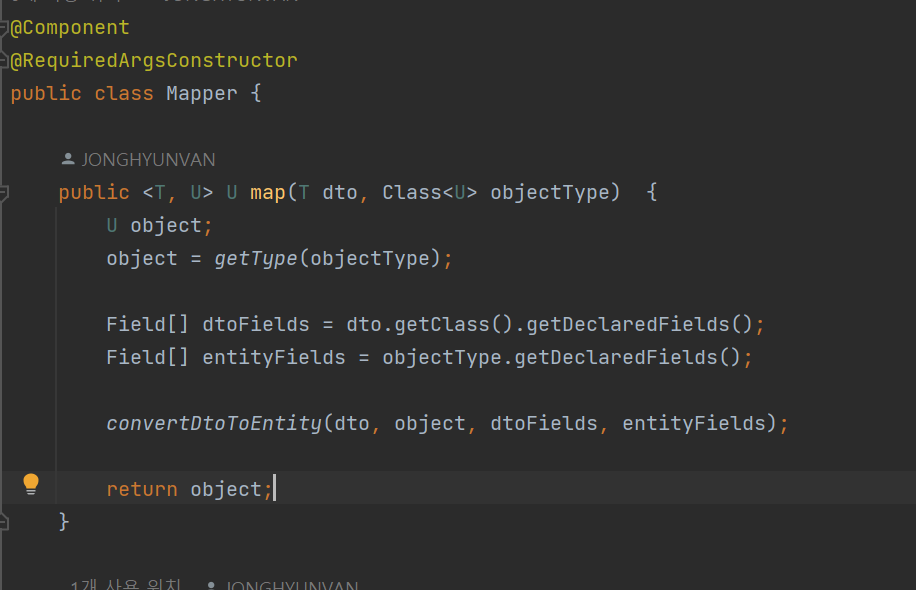
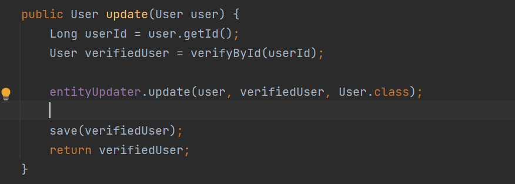
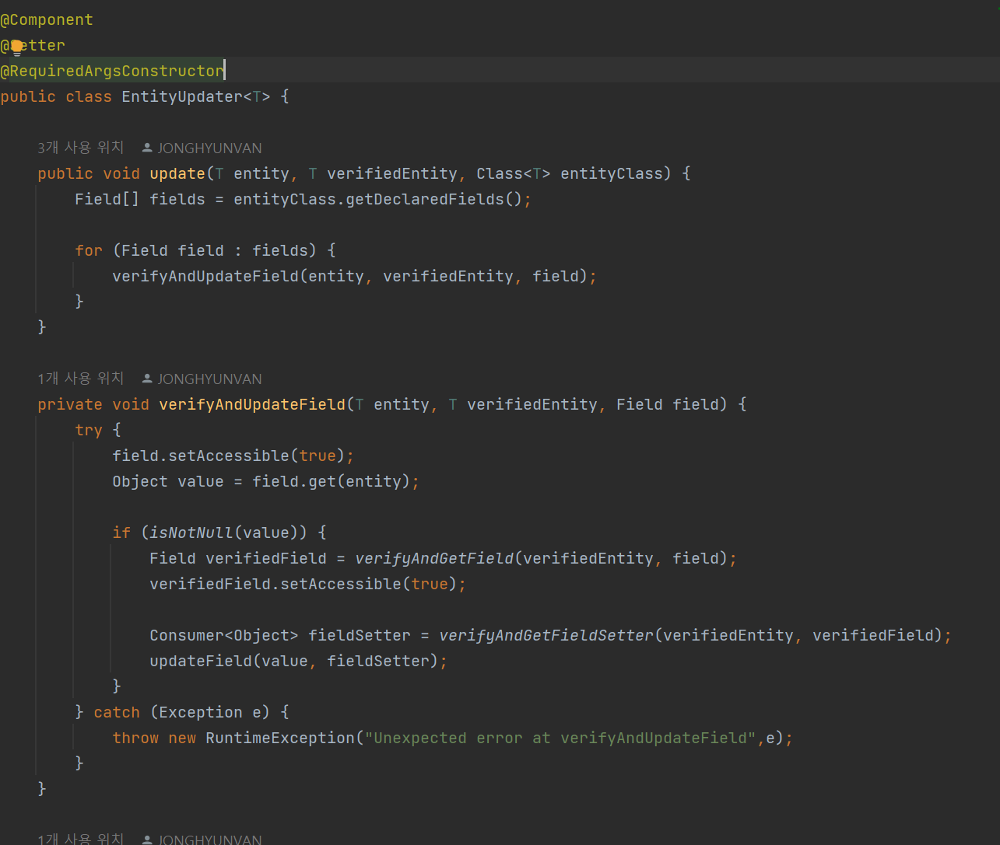
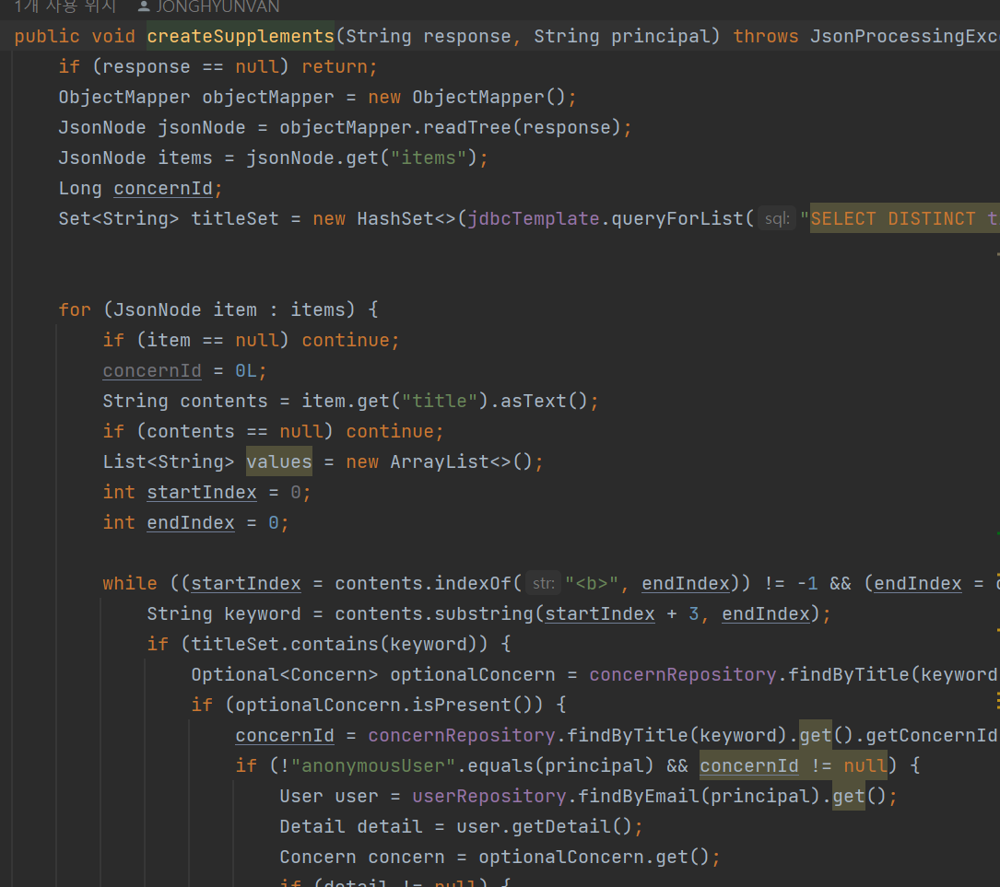
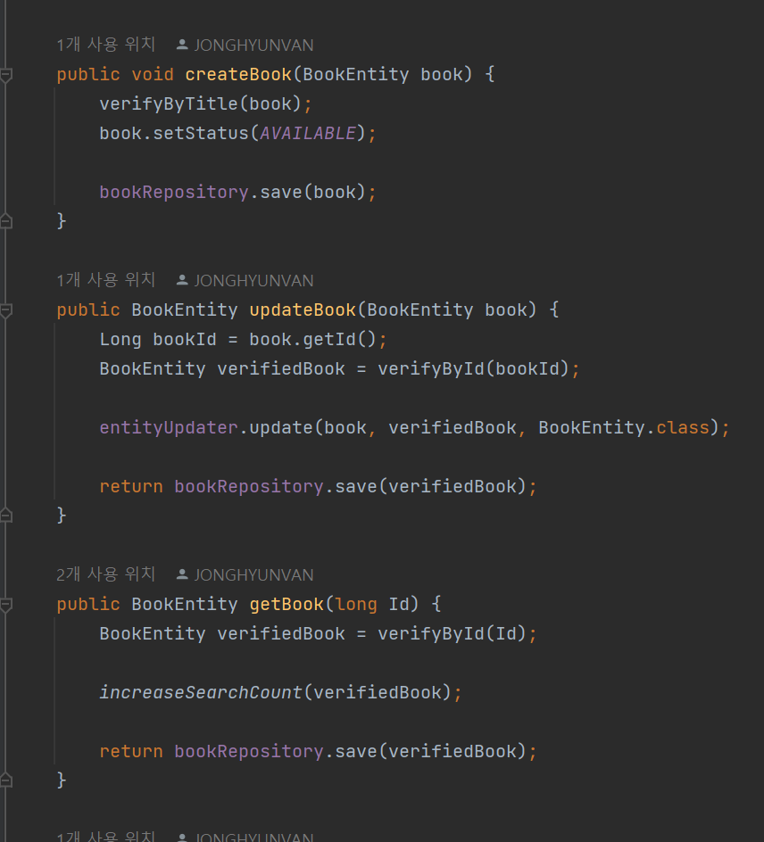

# library-project
 ### library project by JHVAN   
#### 프로젝트 목적 :  사이트의 분위기와 여러 상호작용 요소로 사용자들의 사이트와 책에 대한 관심을 얻고, 로그인한 사용자들의 활동과 관심사에 관한 활동 데이터를 얻는 웹 사이트의 구현   

### 사용 스택 Stacks

### 구현 화면 Implementation screen

 구현 상세 :    

+ 요구사항 정의 :

+ DB Diagram :   
+ https://dbdocs.io/billlys2/lib-project-dbdiagram

 

+ 코드 범용성 향상 : 
기존 : 속도를 중시한 builder 를 사용한 직접 빌드

속도는 빠르지만 도메인, 각각의 케이스마다의 빌드 코드를 필요로 하고,   
DTO 및 엔티티의 변경시 연관된 모든 mapper,update 코드들 역시 수정해야함.

변경 : 제네릭 타입을 이용한 mapper, entity updater 클래스를 활용한 코드

mapper 클래스를 이용하여 매핑이 필요한 모든 도메인에 적용 가능하고,   
DTO 및 엔티티의 변경시에도 mapper 의 변경이 필요하지 않음.
+ 코드 가독성 향상 : 
기존 : 코드 진행 순서와는 일치하지만 역할에 따른 메소드 분리가 되지 않아 가독성면에서 불리한 코드.

변경 : 메소드를 분리 및 추출하여 코드의 가독성을 높이고 각 메소드의 역할 또한 분명히 함.
